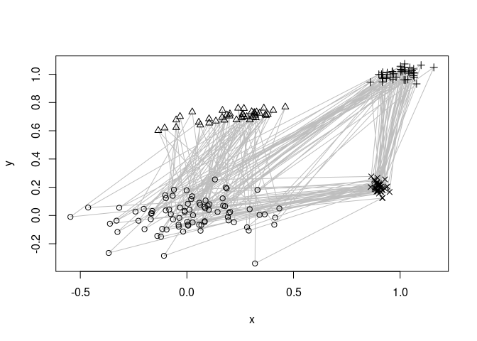
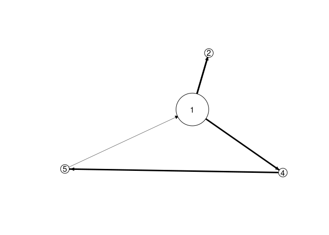

R package rEMM: Extensible Markov Model for Modelling Temporal
Relationships Between Clusters
================

[](https://CRAN.R-project.org/package=rEMM)
[](https://mhahsler.r-universe.dev/ui#package:rEMM)
[](https://CRAN.R-project.org/package=rEMM)

Implements TRACDS (Temporal Relationships between Clusters for Data
Streams), a generalization of Extensible Markov Model (EMM), to model
transition probabilities in sequence data. TRACDS adds a temporal or
order model to data stream clustering by superimposing a dynamically
adapting Markov Chain. Also provides an implementation of EMM (TRACDS on
top of tNN data stream clustering).

## Installation

**Stable CRAN version:** install from within R with

``` r
install.packages("rEMM")
```

**Current development version:** Install from
[r-universe.](https://mhahsler.r-universe.dev/ui#package:rEMM)

## Usage

We use a artificial dataset with a mixture of four clusters components.
Points are generated using a fixed sequence \<1,2,1,3,4\> through the
four clusters. The lines below indicate the sequence.

``` r
library(rEMM)

data("EMMsim")

plot(EMMsim_train, pch = EMMsim_sequence_train)
lines(EMMsim_train, col = "gray")
```

<!-- -->

EMM recovers the components and the sequence information. We use EMM and
then recluster the found structure assuming that we know that there are
4 components. The graph below represents a Markov model of the found
sequence.

``` r
emm <- EMM(threshold = 0.1, measure = "euclidean")
build(emm, EMMsim_train)
emmc <- recluster_hclust(emm, k = 4, method = "average")
plot(emmc)
```

<!-- -->

We can now score new sequences (we use a test sequence created in the
same way as the training data) by calculating the product the transition
probabilities in the model. The high score indicates this.

``` r
score(emmc, EMMsim_test)
```

    ## [1] 0.71

# References

-   Michael Hahsler and Margaret H. Dunham. [rEMM: Extensible Markov
    model for data stream clustering in
    R.](http://dx.doi.org/10.18637/jss.v035.i05) *Journal of Statistical
    Software,* 35(5):1-31, 2010.
-   Michael Hahsler and Margaret H. Dunham. [Temporal structure learning
    for clustering massive data streams in
    real-time](https://doi.org/10.1137/1.9781611972818.57). In *SIAM
    Conference on Data Mining (SDM11),* pages 664–675. SIAM, April 2011.

# Acknowledgements

Development of this package was supported in part by NSF IIS-0948893 and
R21HG005912 from the National Human Genome Research Institute.
